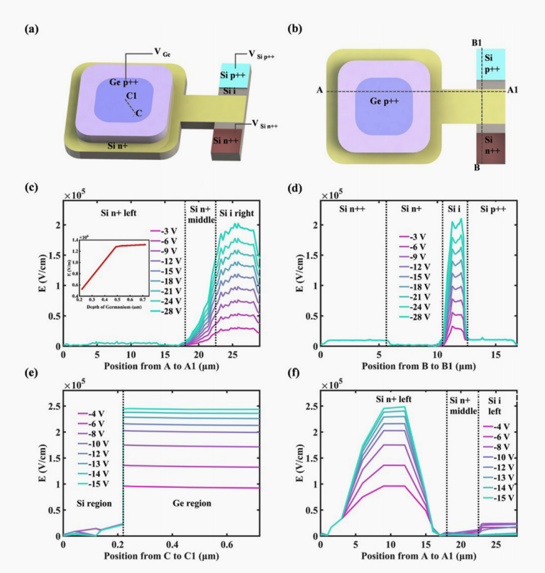
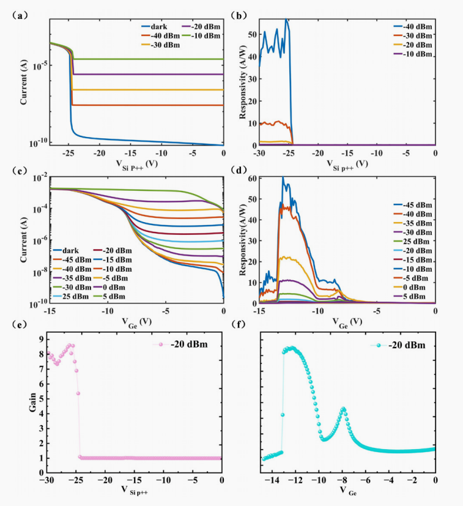
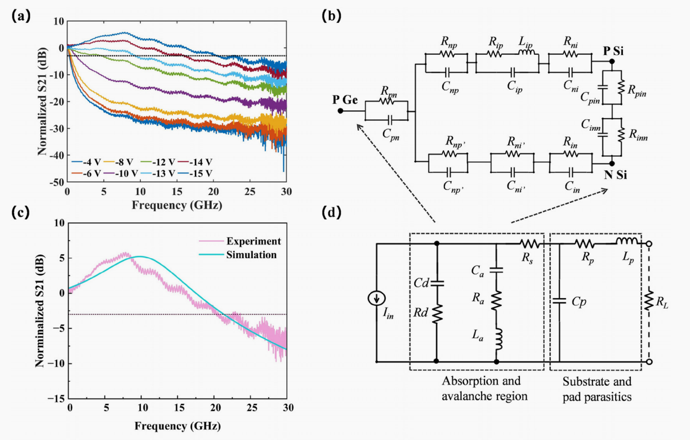

# [低压高带宽面入射三端 Ge-on-Si APD 及多偏置配置研究]

* **📅 阅读日期**：2025-12-27
* **📄 原文标题**：Low voltage and high bandwidth surface-illuminated three-terminal Ge-on-Si APD with multiple biasing configurations
* **👥 作者/团队**：Huan Qu, Junfeng Song et al. @ Jilin University / AMF Singapore
* **📖 期刊/会议**：Applied Physics Letters (Vol. 126, 2025)
* **🔗 链接/DOI**：[10.1063/5.0239942](https://doi.org/10.1063/5.0239942)
* **🏷️ 标签**：#APD #硅光 #三端器件 #雪崩光电二极管 #实验验证

---

## 1. 🚀 核心速览 (30秒回忆版)
* **背景/痛点**：传统的 SACM 型 APD 往往击穿电压较高，且在追求高增益带宽积（GBP）时难以兼顾低电压操作。
* **本文方案**：提出了一种三端（Three-terminal）结构的 Ge-on-Si APD，引入了扩展的 n 型电荷层，并采用**多偏置配置（Multiple biasing configurations）**来分别控制器件的吸收区和倍增区电场。
* **核心结论**：
    * **低电压**：实现了 **-8.1 V** 的超低雪崩击穿电压。
    * **高带宽**：在 -15 V 偏置下，3-dB 带宽达到 **20.4 GHz**。
    * **高灵敏度**：弱光探测能力达到 **-45 dBm**，响应度高达 **60.76 A/W** (@ -13.5 V)。

---

## 2. 🔬 方法与细节 (复现/参考专用)
> *如果我是审稿人，或者是想复现这个实验，我需要知道哪些参数？*

### 2.1 仿真与设计 (TCAD/Circuit Model)
- **结构参数**：Ge 吸收层尺寸为 15 μm × 15 μm × 500 nm。
- **等效电路参数**：为了分析带宽限制，作者建立了包含寄生参数的等效电路模型。关键拟合参数（@ -15V）：
    - 雪崩区电感 **La = 1000 nH** (源于空间电荷效应)。
    - 吸收区电阻 **Rd = 950 Ω**，电容 **Cd = 7 fF**。
- **电场控制**：通过调节 Si p++ 端和 Ge 端的电压，确保 Ge 吸收层电场 >10⁴ V/cm (饱和漂移速度)，Si 倍增层电场 >2.1× 10⁵ V/cm (触发雪崩)。

### 2.2 实验制造 (Fabrication)
- **工艺平台**：Advanced Micro Foundry (AMF), Singapore。
- **晶圆规格**：SOI 晶圆，顶层硅厚度 220 nm。
- **外延生长**：使用 RPCVD (减压化学气相沉积) 进行选择性 Ge 外延生长。

---

## 3. 📊 关键图表解读

### Fig. 1: 器件结构与电场分布

* **解读**：图 (a)(b) 展示了独特的三端结构：左侧为 Ge 吸收区，右侧为 Si APD，中间通过 Si n+ 桥连接。TCAD 仿真证明了通过独立控制三端电压，可以在 Si 区域维持高电场进行倍增，同时保证 Ge 区域载流子以饱和速度漂移。

### Fig. 3: 两种偏置模式下的性能对比

* **解读**：对比了 P-Si 偏置（模式1）和 P-Ge 偏置（模式2）。
    - **P-Si 偏置**：击穿电压高 (-24.9 V)，但在 -40 dBm 下响应度可达 51.28 A/W。
    - **P-Ge 偏置**：击穿电压显著降低至 **-8.1 V**，更利于电路集成，且响应度更高。

### Fig. 4: 射频(RF)特性与带宽

* **解读**：展示了 S21 曲线。随着偏置电压从 -4 V 增加到 -15 V，带宽显著提升。在 -15 V 时，由于空间电荷效应带来的电感峰值效应（Inductive peaking），带宽被拓展至 **20.4 GHz**。

---

## 4. 💡 批判性思考 (最重要的一栏)
- **✅ 优点 (Pros)**：
    - **低电压集成优势**：-8.1 V 的击穿电压远低于传统 SACM 结构（通常 >20V），非常适合与 CMOS 电路单片集成。
    - **灵活调控**：三端设计允许分别优化“吸收”和“倍增”，解耦了这两个过程的相互制约。
    - **模型详实**：提供的等效电路模型考虑了空间电荷效应引入的电感，对高频分析很有参考价值。
- **❌ 缺点/局限 (Cons)**：
    - **GBP 下降**：虽然在 -15V 时带宽最高，但由于增益下降，增益带宽积（GBP）反而略有降低。
    - **工艺复杂性**：相比两端器件，三端器件需要额外的布线和控制电路，可能增加系统设计的复杂度。
- **🧩 对我的启发**：
    - *可以参考他们的等效电路模型（Fig. 4b）来拟合我自己的探测器 S21 数据，特别是引入 La 来表征高功率下的空间电荷效应。*
    - *设计探测器时，如果击穿电压降不下来，可以尝试这种三端分离控制的思路。*

---

## 5. 📝 摘录与生词
- `sentence`: "Three-terminal APDs allow separate electrical control of the absorption and multiplication processes." (三端 APD 允许对吸收和倍增过程进行独立的电学控制。)
- `word`: **Space charge effect** (空间电荷效应) - 在高电流密度下，载流子积累导致电场分布改变，文中利用此效应提升了带宽。
- `word`: **Surface-illuminated** (面入射) - 光从器件表面垂直入射，而非通过波导耦合。

---

## 6. ✅ 下一步行动 (Action Items)
- [ ] 下载文中引用的 Ref. 18 和 Ref. 19，对比一下他们之前的工作有何改进。
- [ ] 在 Lumerical CHARGE 中搭建这个三端模型，验证电场分布是否如 Fig. 1 所示。
- [ ] 将文中 Table I 的寄生参数记录到我的仿真参数表中备用。